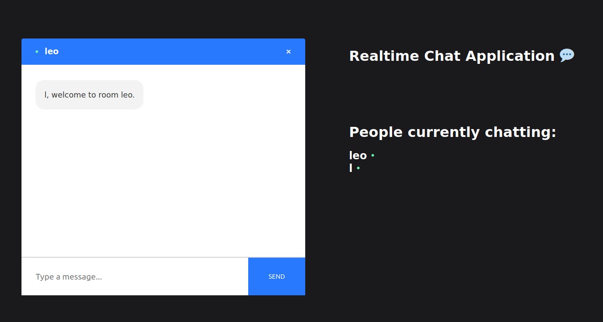

## Prerequisites

[Node.js](http://nodejs.org/) >= v12 must be installed.


# Realtime Chat Application

<p align="center">
  
</p>

## Introduction
This is a code repository created a full Realtime Chat Application. We're going to use  React on the front end, with NodeJS + Socket.io web socket library on the back end. 

Setup:
- run ```npm i && npm start``` for both client and server side to start the development server
